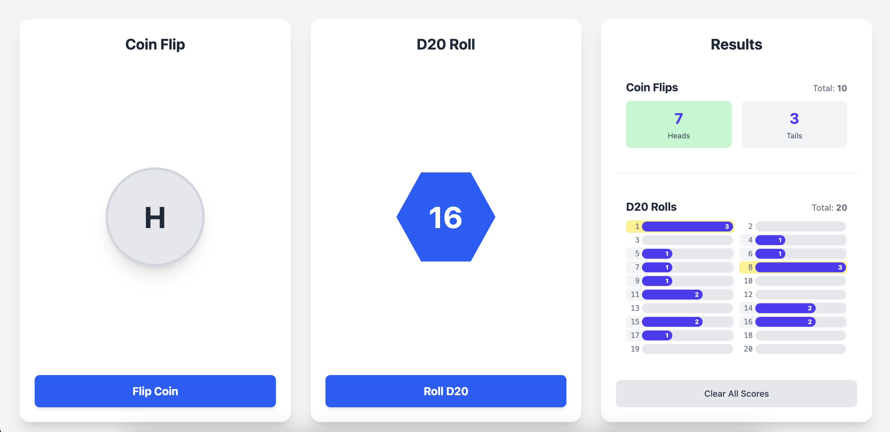

# Coin Flip and D20 Roll App

This web app helps you make small decisions quickly by flipping a coin or rolling a 20-sided die (D20). Sometimes, making a choice within a certain time frame is more important than the choice itself. This tool is designed for those moments when you just need to decide and move forward.

# Live Demo

Try the app live at [coin.chis.dev](https://coin.chis.dev)



## Decision-Making Use Case

You can use this app to:

- **Flip a coin** for simple yes/no or either/or decisions.
- **Roll a D20** for more nuanced choices, such as: "If I roll higher than 5, I'll do it." This lets you set your own criteria for action, especially when you lean toward one option but want a random nudge.


The app tracks your results, so you can see the distribution of coin flips and D20 rolls over time. Your scores are saved locally, making it easy to revisit your decision history.

If you're still hesitant after a single result, you can use the tracked results to do a best-of-3 (bo3) or best-of-5 (bo5) series. This helps you make a more confident decision by seeing which outcome wins more often over several rounds.


## Features

- **Coin Flip:** Instantly get a random result of "Heads" or "Tails".
- **D20 Roll:** Instantly get a random result from 1 to 20.
- **Score Tracking:** See how many times you've flipped heads/tails or rolled each D20 value.
- **Persistent State:** Your results are saved locally, so you can track your decision patterns over time.


## Getting Started

Clone the repository and install dependencies:

```bash
git clone <repository-url>
cd coin
npm install
```

Run the development server:

```bash
npm run dev
```

Open [http://localhost:3000](http://localhost:3000) in your browser.


## Learn More

To learn more about Next.js, check out:

- [Next.js Documentation](https://nextjs.org/docs)
- [Learn Next.js](https://nextjs.org/learn)